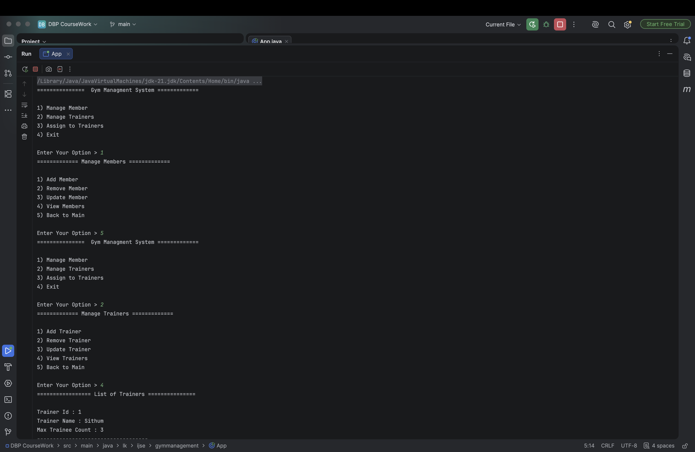
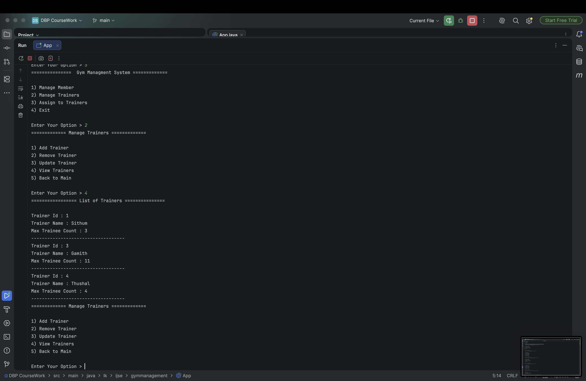

# Gym Management System – DBP Coursework

A **console-based (CLI) Gym Management System** developed in **Java** with **MySQL**, following the **MVC (Model–View–Controller)** architecture.  
This project was created as a **Database Programming (DBP)** coursework.

---

## Features

### Manage Members
- Add Member (Name + Membership Type: Gold / Silver / Regular)
- Remove Member
- Update Member
- View all Members

### Manage Trainers
- Add Trainer (Name + Max Trainee Count)
- Remove Trainer
- Update Trainer
- View all Trainers

### Assign to Trainers
- Assign members to trainers (training sessions)
- Manage training session records

### System
- Menu-driven CLI interface
- MySQL database persistence
- Clean MVC separation

---

## Screenshots

### Main Menu & Member Management


### Manage Trainers


---

## Tech Stack

| Component        | Technology                          |
|------------------|-------------------------------------|
| Language         | Java 11+                            |
| Interface        | Console / CLI                       |
| Database         | MySQL                               |
| JDBC Driver      | MySQL Connector/J 9.x               |
| Build Tool       | Maven                               |
| Architecture     | **MVC** (Model–View–Controller)     |
| Design Patterns  | Singleton (DB Connection), DTO      |

---

## Project Architecture (MVC)

```
┌─────────────────────────────────────┐
│              View Layer             │  GymMenu, MemberView, TrainerView, TrainingSessionView
└─────────────────┬───────────────────┘
                  │
┌─────────────────▼───────────────────┐
│           Controller Layer          │  MemberController, TrainerController, TrainingsessionController
└─────────────────┬───────────────────┘
                  │
┌─────────────────▼───────────────────┐
│             Model Layer             │  MemberModel, TrainerModel, TrainingsessionModel
└─────────────────┬───────────────────┘
                  │
┌─────────────────▼───────────────────┐
│              Database               │  MySQL (gym)
└─────────────────────────────────────┘
```

**Supporting packages:**
- `dto` – Data Transfer Objects (Member, Trainer, TrainingSession)
- `db` – Database connection (Singleton)
- `util` – CrudUtil helper

---

## Prerequisites

- **JDK 11** or higher
- **Maven 3.6+**
- **MySQL Server 8.x**

---

## Database Setup

1. Create the database:
   ```sql
   CREATE DATABASE gym;
   ```

2. Create required tables (example structure):

   ```sql
   -- Members
   CREATE TABLE member (
       id INT PRIMARY KEY AUTO_INCREMENT,
       name VARCHAR(100) NOT NULL,
       membership_type VARCHAR(50)
   );

   -- Trainers
   CREATE TABLE trainer (
       id INT PRIMARY KEY AUTO_INCREMENT,
       name VARCHAR(100) NOT NULL,
       max_trainee_count INT
   );

   -- Training sessions / Assignments
   CREATE TABLE training_session (
       id INT PRIMARY KEY AUTO_INCREMENT,
       member_id INT,
       trainer_id INT,
       FOREIGN KEY (member_id) REFERENCES member(id),
       FOREIGN KEY (trainer_id) REFERENCES trainer(id)
   );
   ```

3. Update credentials if needed in:
   ```
   src/main/java/lk/ijse/gymmanagement/db/DBConnection.java
   ```
   Default:
   ```
   jdbc:mysql://localhost:3306/gym
   username: root
   password: mysql
   ```

---

## How to Run

### Option 1 – Maven

```bash
# Build
mvn clean compile

# Run
mvn exec:java -Dexec.mainClass="lk.ijse.gymmanagement.App"
```

### Option 2 – IDE

1. Open the project in IntelliJ IDEA / NetBeans / Eclipse.
2. Ensure MySQL is running and the `gym` database exists.
3. Run the main class:
   ```
   lk.ijse.gymmanagement.App
   ```

---

## Project Structure

```
DBP CourseWork/
├── src/main/java/lk/ijse/gymmanagement/
│   ├── App.java                 # Entry point
│   ├── view/                    # View layer (menus & UI)
│   │   ├── GymMenu.java
│   │   ├── MemberView.java
│   │   ├── TrainerView.java
│   │   └── TrainingSessionView.java
│   ├── controller/              # Controller layer
│   │   ├── MemberController.java
│   │   ├── TrainerController.java
│   │   └── TrainingsessionContoller.java
│   ├── model/                   # Model layer (DB operations)
│   │   ├── MemberModel.java
│   │   ├── TrainerModel.java
│   │   └── TrainingsessionModel.java
│   ├── dto/                     # Data Transfer Objects
│   ├── db/                      # DB Connection
│   └── util/                    # Helpers
├── pom.xml
└── README.md
```

---

## Menu Flow

```
Gym Management System
├── 1) Manage Member
│       ├── Add / Remove / Update / View Members
│       └── Back to Main
├── 2) Manage Trainers
│       ├── Add / Remove / Update / View Trainers
│       └── Back to Main
├── 3) Assign to Trainers
│       └── Training session management
└── 4) Exit
```

---

## Author

**G. D. Mayantha**  
GitHub: [Mayantha2003](https://github.com/Mayantha2003)

**Course:** Database Programming (DBP) – IJSE

---

## License

This project is intended for educational / coursework purposes.
